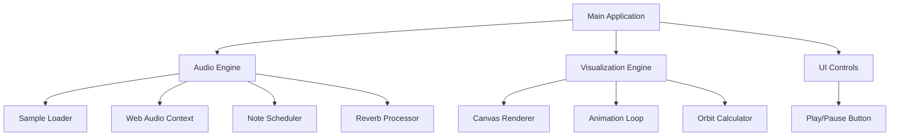
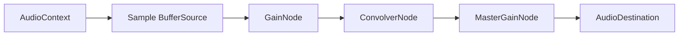
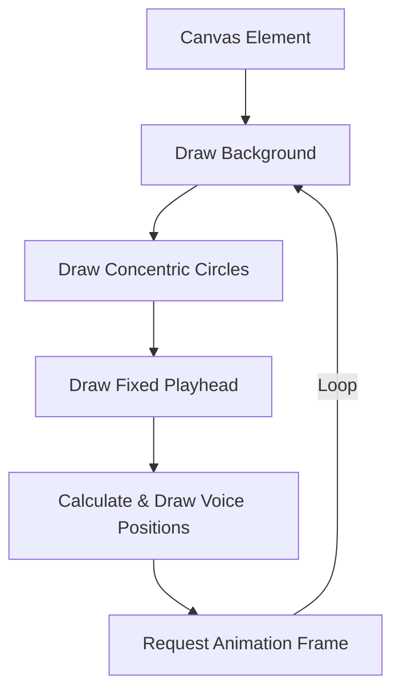

# Implementation Plan: Brian Eno's "2/1" Web Recreation

## 1. Project Overview

We'll build a web application that recreates Brian Eno's "2/1" from Music for Airports with:

- **Exact Musical Recreation**: Using the 7 notes and precise loop durations you specified
- **High-Quality Audio**: Electric piano samples with spacious reverb
- **Elegant Visualization**: Orbiting dots on concentric circles with a fixed playhead
- **Simple Controls**: Minimal play/pause functionality only
- **Deployment**: Vercel deployment with local testing capability

## 2. Technical Architecture



## 3. Data Model

```javascript
// The 7 voices with their exact loop durations
const voices = [
  { 
    note: "High A♭", 
    frequency: 830.61, // A♭5 in Hz
    loopDuration: 17.8, // seconds
    color: "#E57373" // Optional: unique color per voice
  },
  { 
    note: "C", 
    frequency: 523.25, // C5 in Hz
    loopDuration: 20.1, 
    color: "#FFB74D" 
  },
  { 
    note: "D♭", 
    frequency: 554.37, // D♭5 in Hz
    loopDuration: 31.8, 
    color: "#FFF176" 
  },
  { 
    note: "High F", 
    frequency: 698.46, // F5 in Hz
    loopDuration: 19.6, 
    color: "#AED581" 
  },
  { 
    note: "E♭", 
    frequency: 622.25, // E♭5 in Hz
    loopDuration: 16.2, 
    color: "#4FC3F7" 
  },
  { 
    note: "Low A♭", 
    frequency: 415.30, // A♭4 in Hz
    loopDuration: 21.3, 
    color: "#7986CB" 
  },
  { 
    note: "Low F", 
    frequency: 349.23, // F4 in Hz
    loopDuration: 24.7, 
    color: "#BA68C8" 
  }
];
```

## 4. Technical Components Breakdown

### 4.1 Audio Implementation

#### Electric Piano Sample Options:
1. **Salamander Piano**: Free, high-quality sampled grand piano
2. **PianoBook**: Collection of free, high-quality piano samples
3. **Virtual Playing Orchestra**: Free orchestral samples including piano

#### Reverb Implementation:
1. **Convolution Reverb**: Using the Web Audio API's ConvolverNode
2. **Impulse Response Options**: Large hall IRs from OpenAIR library

#### Audio Engine Architecture:


### 4.2 Visualization Design (Canvas-based)

Canvas was chosen for the visualization as it offers better performance for continuous animations of multiple elements.



#### Orbit Calculation:
Each voice's position is calculated based on:
- Current time
- Individual loop duration
- Angular position = (currentTime % loopDuration) / loopDuration * 2π

#### Visual Styling:
- **Minimal Design**: Clean lines, subtle gradients
- **Circle Sizing**: Proportional to loop duration (longer loops = larger circles)
- **Color Scheme**: Subtle pastel palette with sufficient contrast
- **Animation**: Smooth transitions with requestAnimationFrame

### 4.3 User Interface

#### Controls:
- **Play/Pause Button**: Simple toggle to start/stop all voice loops

#### Layout:
```
┌─────────────────────────────────────┐
│                                     │
│                                     │
│             [Orbits                 │
│              Visual                 │
│            Rendering]               │
│                                     │
│                                     │
│                                     │
├─────────────────────────────────────┤
│           [Play/Pause]              │
└─────────────────────────────────────┘
```

## 5. Implementation Steps

### Phase 1: Project Setup
1. Initialize repository structure
2. Set up build system (if needed)
3. Create basic HTML/CSS framework
4. Set up testing environment

### Phase 2: Audio Engine
1. Implement sample loading mechanism
2. Set up Web Audio API context
3. Create reverb processing chain
4. Build note scheduler based on voice data
5. Implement play/pause functionality

### Phase 3: Visualization
1. Create canvas element
2. Implement orbit drawing logic
3. Create animation loop
4. Synchronize visual elements with audio playback
5. Add playhead logic

### Phase 4: Integration & Polish
1. Connect audio and visual components
2. Implement play/pause control
3. Add responsive design considerations
4. Optimize performance
5. Add loading indicators

### Phase 5: Testing & Deployment
1. Test audio scheduling accuracy
2. Test cross-browser compatibility
3. Write documentation
4. Set up deployment pipeline
5. Deploy to Vercel

## 6. Project Structure

```
/ (root)
├─ index.html
├─ styles/
│   └─ main.css
├─ scripts/
│   ├─ main.js
│   ├─ audio-engine.js
│   ├─ visualization.js
│   └─ ui-controls.js
├─ assets/
│   ├─ samples/
│   │   └─ piano-sample.mp3
│   └─ reverb/
│       └─ large-hall-ir.wav
├─ tests/
│   ├─ audio-engine.test.js
│   └─ visualization.test.js
└─ README.md
```

## 7. Local Testing & Deployment

### Local Testing Options:
1. **Simple HTTP Server**:
   ```bash
   # Using Python (if installed)
   python -m http.server 8000
   
   # Or using Node.js (if installed)
   npx serve
   ```

2. **Live Server** (VS Code extension):
   - Install the Live Server extension in VS Code
   - Right-click on index.html and select "Open with Live Server"

### Vercel Deployment:
1. **Setup**:
   ```bash
   # Install Vercel CLI
   npm install -g vercel
   ```

2. **Deployment**:
   ```bash
   # Initialize Vercel
   vercel login
   
   # Deploy from project directory
   vercel
   
   # Deploy to production
   vercel --prod
   ```

3. **Configuration**:
   - Create a `vercel.json` file for custom configuration if needed:
   ```json
   {
     "name": "eno-2-1",
     "version": 2,
     "public": true
   }
   ```

## 8. Music Details (Brian Eno's "2/1")

### Notes and Loop Durations:
1. High A♭ - 17.8 second loop
2. C - 20.1 second loop
3. D♭ - 31.8 second loop
4. High F - 19.6 second loop
5. E♭ - 16.2 second loop
6. Low A♭ - 21.3 second loop
7. Low F - 24.7 second loop

## 9. Timeline Estimate

- **Phase 1**: 1 day
- **Phase 2**: 2-3 days
- **Phase 3**: 2-3 days
- **Phase 4**: 1-2 days
- **Phase 5**: 1 day

**Total Estimated Time**: 7-10 days